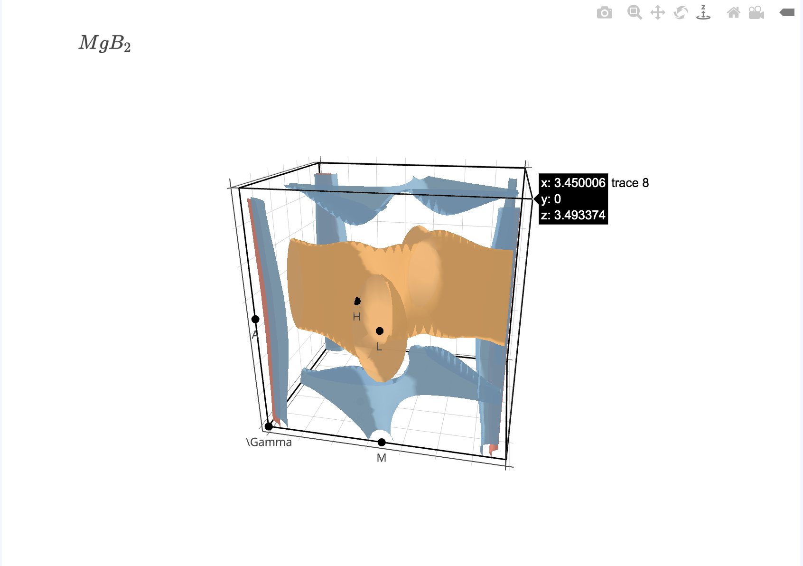

IFermi
------

IFermi is a package which provides tools for plotting Fermi surfaces
from DFT output. IFermi is also useful for visualisation of slices of
the three-dimensional Fermi surface along a specified plane. The idea 
is to provide tools which allow for more tailored Fermi surface plots
than what other plotting software currently offer.

The main features include:

1. **Plotting of three-dimensional Fermi surfaces, with interactive plotting
   supported by Mayavi_, Plotly_ and Matplotlib_ (see recommended 
   libraries below).**

2. **Taking a slice of a three-dimensional Fermi surface along a specified 
   plane and plotting the resulting contour.**

3. **Identification and visualisation of vanishingly small Fermi surfaces**

   - useful in the identification of Dirac points.
   - requires a DFT scf calculation on a more fine k-mesh

Notes about the use of external libraries: 

   - VASP calculations are imported using Pymatgen_.
   - Band interpolation is carried out using BoltzTraP2_   
   - Plotting is supported in Mayavi_, Plotly_ and Matplotlib_.
   - I reccomned using Mayavi_ or Plotly_ for three-dimensional
     Fermi surface visualisation, and Matplotlib_ for two 
     plotting two-dimensional slices. 

The code currently primarily supports VASP calculations, but will 
soon be extended to other platforms supported by Pymatgen_ 
(Quantum Espresso, Questaal, etc.)


### Python interface

IFermi is made up of a number of classes for building and plotting
Fermi surfaces. This includes:

- `FermiSurface`: stores isosurfaces at the Fermi-level for use in plotting,
   as well as other useful structural information. 
- `Interpolator`: Takes energies specified on a uniform k-mesh and interpolates 
   this to a finer k-mesh.
- `Plotter`: Given a FermiSurface object, produces an interactive plot   

A minimal working example for plotting the 3d Fermi surface of MgB2 from a POSCAR
file and Vasprun.xml file is:

```python
from interpolator import Interpolater
from fermi_surface import FermiSurface
from brillouin_zone import BrillouinZone, RecipCell
from plotter import *

from pymatgen.io.vasp.outputs import Vasprun
from pymatgen.electronic_structure.core import Spin
from pymatgen.electronic_structure.bandstructure import BandStructure

if __name__ == '__main__':
	vr = Vasprun("/Users/amyjade/Documents/3rdYear/URAP/PlottingProgram/dataMgB2/vasprun.xml")
	bs = vr.get_band_structure()

	# increase interpolation factor to increase density of interpolated bandstructure
	interpolater = Interpolater(bs) 

	new_bs, hdims, rlattvec = interpolater.interpolate_bands(10)

	rc = RecipCell(rlattvec)

	bz = BrillouinZone(rlattvec)

	# Make a three dimensional plot of the Brillioun zone

	fs = FermiSurface(new_bs, hdims, rlattvec, mu = 0.0, plot_wigner_seitz = True)

	plotter = FSPlotter(fs, rc = None, bz = bz)

	plotter.fs_plot_data(plot_type = 'mayavi')

```

### Example output

An example of the output generated by IFermi for MgB<sub>2</sub> is shown below:




## Detailed requirements

IFermi is currently compatible with Python 3.5+ and relies on a number of
open-source python packages, specifically:

- Pymatgen_ (version >= 2017.12.30)
- Numpy_
- Scipy_
- Matplotlib_

.. _matplotlib: https://matplotlib.org
.. _numpy: http://www.numpy.org
.. _pymatgen: http://pymatgen.org
.. _scipy: https://www.scipy.org


## Contributing

If you think that the code could use some improvement
or added functionality, send a push request to the GitHub page. 
I would greatly appreciate any contributions.

## License

IFermi is made available under the MIT License.

## Acknowledgements

Alex Ganose for help developing/improving code.
Sinead Griffin for suggesting the project.
